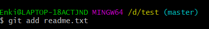

## 项目结构说明

## 


#  HTTP协议

## 1 HTTP协议概述

### 1.1 HTTP协议概念

HTTP的全称是：Hyper Text Transfer Protocol，意为 超文本传输协议。它指的是服务器和客户端之间交互必须遵循的一问一答的规则。形容这个规则：问答机制、握手机制。

它规范了请求和响应内容的类型和格式。

HTTP协议是由`WC`组织管理和维护的。

### 1.2 HTTP协议版本

目前HTTP协议主要是1.0版本和1.1版本。这两个版本的区别主要是两个方面。

第一：HTTP1.1版本比1.0版本多了一些消息头。

第二：HTTP1.1版本和1.0版本的执行过程不一样。执行过程如下：

| HTTP1.0            | HTTP1.1                |
| ------------------ | ---------------------- |
| 创建连接（TCP/IP） | 创建连接（TCP/IP）     |
| 发送请求           | 发送请求1              |
| 得到响应           | 得到响应1              |
| 关闭连接           | 发送请求2              |
| 创建连接（TCP/IP） | 得到响应2              |
| 发送请求           | .......                |
| 得到响应           | .......                |
| 关闭连接           | 连接超时或手动关闭连接 |

### 1. HTTP协议相关说明

HTTP协议概念是客户浏览器和服务器一种一问一答的规则，那么必须要**有问有答，而且要先问后答。**
但是我们使用`<script>`,`<link>`和``标签，没有手动发起请求，但是仍然能从服务器端拿到数据，原因就是：**在浏览器遇到`<script>`,`<link>`,``标签时会自动发出请求。**

## 2 HTTP协议组成

由HTTP协议的概念可知，它分为问和答两部分。其中**问**指的就是请求部分，而**答**指的就是响应部分。

### 2.1请求部分  

请求行： 永远位于请求的第一行
请求消息头： 从第二行开始，到第一个空行结束
请求的正文： 从第一个空行后开始，到正文的结束


### 2.2 响应部分

响应行： 永远位于响应的第一行
响应消息头： 从第二行开始，到第一个空行结束
响应的正文： 从第一个空行后开始，到正文的结束


###  消息头的共性分析

消息头名称**首字母大写**，多个单词**每个单词的首字母**都大写。
多个单词用<b><font color='red'>-</font></b>分隔
名称和值之间用<b><font color='red'>冒号加空格</font></b>分隔
多个值之间用<b><font color='red'>逗号加空格</font></b>分隔
两个头之间用<b><font color='red'>回车</font></b>分隔

##  请求部分详解

### 1 请求行详解

请求行：`GET /myapp/2.html HTTP/1.1`

| 内容          | 说明                       |
| ------------- | -------------------------- |
| GET           | 请求的方式。（还有POST）   |
| /myapp/2.html | 请求的资源。               |
| HTTP/1.1      | 使用的协议，及协议的版本。 |

### 2 请求消息头详解

| 内容                   | 说明                                                         |
| ---------------------- | ------------------------------------------------------------ |
| Accept                 | 告知服务器，客户浏览器所支持的MIME类型。                     |
| Accept-Encoding        | 告知服务器，客户浏览器所支持的压缩编码格式。最常用的就是gzip压缩。 |
| Accept-Language        | 告知服务器，客户浏览器所支持的语言。一般都是zh_CN或en_US等。 |
| Referer                | 告知服务器，当前请求的来源。<br/>只有当前请求有来源的时候，才有这个消息头。从地址栏输入的没有来源。<br/>作用：1 投放广告  2 防盗链 |
| Content-Type           | 告知服务器，请求正文的MIME类型。                             |
| Content-Length         | 告知服务器，请求正文的长度。                                 |
| User-Agent             | 浏览器相关信息                                               |
| Connection: Keep-Alive | 连接的状态：保持连接                                         |
| If-Modified-Since      | 告知服务器，客户浏览器缓存文件的最后修改时间。               |
| Cookie（********）     | 会话管理相关，非常的重要。                                   |

### 请求正文详解

第一：只有post请求方式，才有请求的正文。get方式的正文是在地址栏中的。
第二：表单的输入域有name属性的才会被提交。不分get和post的请求方式。
第三：表单的enctype属性取值决定了请求正文的体现形式。概述的含义是：请求正文的MIME编码类型。

| enctype取值                       | 请求正文体现形式                                   | 示例                                                         |
| --------------------------------- | -------------------------------------------------- | ------------------------------------------------------------ |
| application/x-www-form-urlencoded | key=value&key=value                                | username=test&password=124                                   |
| multipart/form-data               | 此时变成了多部分表单数据。多部分是靠分隔符分隔的。 | -----------------------------7df2a16c0210<br/>Content-Disposition: form-data; name="username"<br/><br/>test<br/>-----------------------------7df2a16c0210<br/>Content-Disposition: form-data; name="password"<br/><br/>124<br/>-----------------------------7df2a16c0210<br/>Content-Disposition: form-data; name="headfile"; filename="C:\Users\zhy\Desktop\请求部分.jpg"<br/>Content-Type: image/pjpeg<br/>-----------------------------7df2a16c0210 |

## 4 响应部分详解

### 4.1 响应行详解

响应行：`HTTP/1.1 200 OK`

| 内容     | 说明             |
| -------- | ---------------- |
| HTTP/1.1 | 使用协议的版本。 |
| 200      | 响应状态码       |
| OK       | 状态码描述       |

常用状态码介绍：

| 状态码 | 说明                                             |
| ------ | ------------------------------------------------ |
| 200    | 一切都OK>                                        |
| 02/07  | 请求重定向(客户端行为，两次请求，地址栏发生改变) |
| 04     | 请求资源未发生变化，使用缓存                     |
| 404    | 请求资源未找到                                   |
| 500    | 服务器错误                                       |

### 4.2 响应消息头详解

| 消息头                  | 说明                                                         |
| ----------------------- | ------------------------------------------------------------ |
| Location                | 请求重定向的地址，常与02,07配合使用。                        |
| Server                  | 服务器相关信息。                                             |
| Content-Type            | 告知客户浏览器，响应正文的MIME类型。                         |
| Content-Length          | 告知客户浏览器，响应正文的长度。                             |
| Content-Encoding        | 告知客户浏览器，响应正文使用的压缩编码格式。常用的gzip压缩。 |
| Content-Language        | 告知客户浏览器，响应正文的语言。zh_CN或en_US等等。           |
| Content-Disposition     | 告知客户浏览器，以下载的方式打开响应正文。                   |
| Refresh                 | 定时刷新                                                     |
| Last-Modified           | 服务器资源的最后修改时间。                                   |
| Set-Cookie（*******）   | 会话管理相关，非常的重要                                     |
| Expires:-1              | 服务器资源到客户浏览器后的缓存时间                           |
| Catch-Control: no-catch | 不要缓存，//针对http协议1.1版本                              |
| Pragma:no-catch         | 不要缓存，//针对http协议1.0版本                              |

### 4. 响应正文详解

就和我们在浏览器上右键查看源文件看到的内容是一样的。

```html
<html>
    <head>
        <link rel="stylesheet" href="css.css" type="text/css">
        <script type="text/javascript" src="demo.js"></script>
    </head>
    <body>
        
    </body>
</html>
```

# Git（黑马版本）

## 版本控制的方式

* 集中版本控制工具

  集中式版本控制工具，版本库是集中存放在中央服务器的，team里每个人work时从中央服务器下载代 

  码，是必须联网才能工作，局域网或互联网。个人修改后然后提交到中央版本库。

  举例：SVN和CVS

* 分布式版本控制工具

  分布式版本控制系统没有“中央服务器”，每个人的电脑上都是一个完整的版本库，这样工作的时候，无 

  需要联网了，因为版本库就在你自己的电脑上。多人协作只需要各自的修改推送给对方，就能互相看到对方的 

  修改了。

  举例：Git
  
## Git分布式控制方式

Git是分布式的,Git不需要有中心服务器，我们每台电脑拥有的东西都是一样的.git是一个开源的分布式版本控制系统，可以有效、高速地处理从很小到非常大的项目版本管理。Git是 Linus Torvalds 为了帮助管理 Linux 内核开发而开发的一个开放源码的版本控制软件。


## Git工作流程


***命令***

- clone 从远程仓库中克隆代码到本地仓、
- checkcout 从本地仓库中检出一个仓库分支然后进行修改
- add 在提交前将代码提交到缓存区中‘
- commit 提交到本地仓库 本地仓库中保存修改的各个历史版本
- fetch 从远程库中 抓取到本地仓库 不进行任何的合并动作 一般操作较少
- pull 从远程库拉到本地库 自动进行合并 然后进行合并 放到工作区中 相当于fetch+merge
- push 修改完成后需要和团队成员共享代码时 将代码推送到远程仓库

### Git安装和常用命令

全部例子使用Git bash，用到一些基本的Linux命令

* ls/ll 查看当前目录
* cat 查看文件内容
* touch 创建文件
* vi vi编辑器

### 基本配置信息

第一次使用可以设置用户信息

git config --global user.name "Enki"

git config --global user.email "17855378518@163.com"

查看配置信息


### 为常见命令创建别名

在有些命令参数复杂的情况下，我们可以使用别名

1. 打开用户目录 创建.bashrc文件


2. 在.brashrc中输入

   

3. 打开.brashrc 执行

   

### gitBash乱码问题


### 获取本地仓库

1. 新建一个空目录作为git的本地仓库
2. 进入这个目录中 点击右键打开git bash窗口
3. 执行命令 git init
4. 创建成功后可以在文件夹下面看见隐藏的.git目录


**.git**

这个目录是Git来跟踪管理版本库的，不要手动改变目录中的文件


### 基础操作指令

Git工作目录下对于文件的**修改**(增加、删除、更新)会存在几个状态，这些**修改**的状态会随着我们执行Git

的命令而发生变化。


用命令来控制这些状态之间的转换:

1. git add (工作区 --> 暂存区)
2. git commit (暂存区 --> 本地仓库)

#### 查看修改计划

git status 查看修改的状态

#### 添加工作区到暂存区

git add 单个文件名|通配符 

添加一个或多个的修改到暂存区




#### 提交暂存区到本地仓库（commit）

git commit -m '注释内容'

将暂存区的内容把文件提交到仓库


**可以多次add不同文件并一次提交**


#### 查看提交日志

之前在配置别名时 git-log 包含了一些参数 现在可以直接使用指令 git-log

git log [option]

option:

* --all 显示所有分支

* --pretty=oneline 将提交信息显示为一行

* --abbrev-commit 使得输出的commit更简短

* --graph 以图的形式显示

  

#### 版本退回

修改两次文件


git reset --hard commitID

**commitID 可以使用git  log 来查看**


git log 显示从最近到最远的历史信息

**退回一次版本**


此时查看git log


说明回到了修改一次文件的时候，但只要窗口未关闭依旧可以找到原先修改两次的时候，也就是回到现在状态的未来得到修改两次的文件


也可以通过git reflog来知道已删除的版本ID


#### 添加文件到忽略列表


#### 分支

分支意味着你可以把你的工作从开发主线上分离开来进行重大的Bug修改、开发新的功能，以免影响开发主线。

#### 查看本地分支

git branch


#### 创建本地分支

git branch 分支名

#### 切换分支

git checkout 分支名

我们还可以直接切换到一个不存在的分支（创建并切换）

git checkout -b 分支名

#### 合并分支

git merge 分支名称

#### 删除分支


#### 解决冲突

当两个分支对文件的修改可能存在冲突，例如同时修改了同一个文件的同一行，需要手动解决冲突步骤：

* 处理文件中冲突的地方

* 将解决完冲突的文件加入到暂存区

* 提交到仓库


#### git简明教程

https://www.bootcss.com/p/git-guide/

### git操作
仓库建完后

# SpringMVC

### github搭建自己的博客

#### 404问题


### 正则表达式

用`\d`可以匹配一个数字，`\w`可以匹配一个字母或数字，`.`可以匹配任意字符，`*`表示任意个字符（包括0个），用`+`表示至少一个字符，用`?`表示0个或1个字符，用`{n}`表示n个字符，用`{n,m}`表示n-m个字符